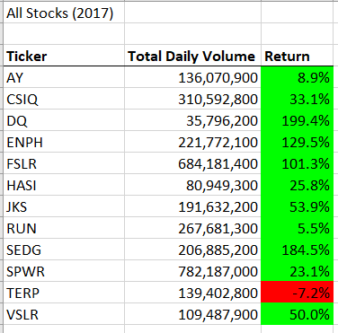
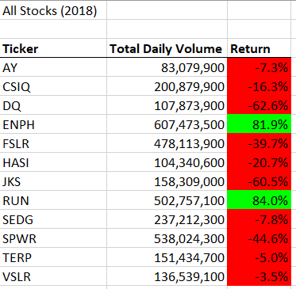
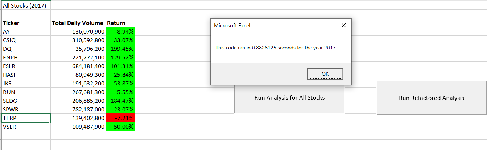
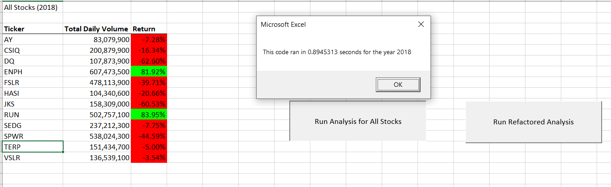
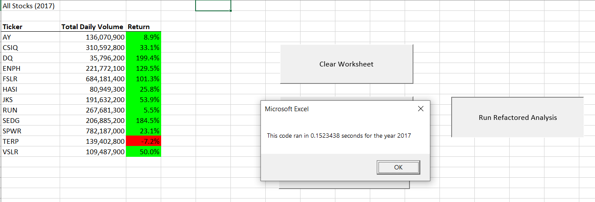
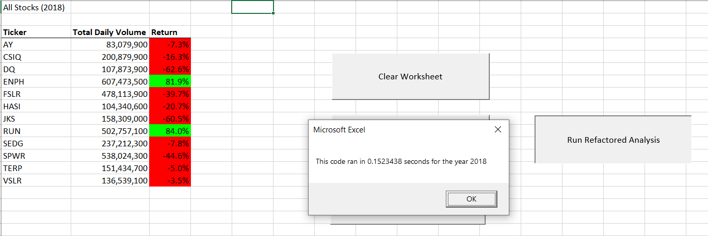

# Analyzing Stocks With VBA
----------
## Overview of Project

### This analysis was designed to assist Steve with easily summarizing and comparing stock trends for twelve companies from 2017 and 2018. By looking at the total trading volume of a company's stocks and their yearly return percentage, Steve can help his parents make an informed decision on which of these companies will likely be a profitable investment.

##Results

###2017 and 2018 Stock Comparison

 
In comparing 2017 and 2018 total daily volumes of stock trading and return percentages, there does not appear to be an indication that increased trading equals a higher return percentage for a company's investors. Only two companies, _RUN_ and _TERP_, had increases in trading volume AND return percentage from 2017 to 2018, even though seven of the twelve companies experienced increased trading in that time. A lack of trading does not appear to benefit the percentage either, as the other five companies that had a decrease in trading from 2017 to 2018 all had a decrease in return percentage as well.

Given the success of the 2017 market, it is easy to see why Steve's parents would want to invest in DQ (even beyond the ticker name), however in comparing the general 2017 success with the 2018 loss, we can see the market is quite volatile year to year. Diversifying one's stock portfolio provides the greatest chance of having a profitable return percentage over time.

 

###Original VBA Code For Analysis

To achieve this quick analysis of Steve's data, I build the VBA macro below to pull and compile this data into the tables shown above.
 
	`Sub AllStocksAnalysis()

	'1)Format the output sheet on the "All Stocks Analysis" worksheet
    
    Worksheets("All Stocks Analysis").Activate

    Dim startTime As Single
    Dim endTime As Single

    'Ask user what year to pull data from
    yearValue = InputBox("What year would you like to run the analysis on?")
    
    startTime = Timer

        Range("A1").Value = "All Stocks (" + yearValue + ")"

        'Create a header row
        Cells(3, 1).Value = "Ticker"
        Cells(3, 2).Value = "Total Daily Volume"
        Cells(3, 3).Value = "Return"

	'2)Initialize an array of all tickers

    Dim tickers(12) As String

    tickers(0) = "AY"
    tickers(1) = "CSIQ"
    tickers(2) = "DQ"
    tickers(3) = "ENPH"
    tickers(4) = "FSLR"
    tickers(5) = "HASI"
    tickers(6) = "JKS"
    tickers(7) = "RUN"
    tickers(8) = "SEDG"
    tickers(9) = "SPWR"
    tickers(10) = "TERP"
    tickers(11) = "VSLR"
    
	'3a)Initialize variables for the starting price and ending price

    Dim startingPrice As Double
    Dim endingPrice As Double

	'3b)Activate the data worksheet

    Worksheets(yearValue).Activate

	'3c)Find the number of rows to loop over

    RowCount = Cells(Rows.Count, "A").End(xlUp).Row

	'4)Loop through the tickers

    For i = 0 To 11
        ticker = tickers(i)
        totalVolume = 0
        
    	'5)Loop through rows in the data
        	Worksheets(yearValue).Activate
        	For j = 2 To RowCount
    
            	'5a)Find the total volume for the current ticker
            
            	If Cells(j, 1).Value = ticker Then
                	totalVolume = totalVolume + Cells(j, 8).Value
            	End If

            	'5b)Find the starting price for the current ticker
            
            	If Cells(j, 1).Value = ticker And Cells(j - 1, 1).Value <> ticker Then
                	startingPrice = Cells(j, 6).Value
            	End If

            	'5c)Find the ending price for the current ticker
            
            	If Cells(j, 1).Value = ticker And Cells(j + 1, 1).Value <> ticker Then
                	endingPrice = Cells(j, 6).Value
            	End If
            
        	Next j
        
    '6)Output the data for the current ticker
    
        Worksheets("All Stocks Analysis").Activate
    
        Cells(4 + i, 1).Value = ticker
        Cells(4 + i, 2).Value = totalVolume
        Cells(4 + i, 3).Value = endingPrice / startingPrice - 1
    
    Next i
    
    Worksheets("All Stocks Analysis").Activate

	'Bold and underline border fomatting
	Range("A3:C3").Font.Bold = True  'Or Range("A3:C3").Font.FontStyle = "Bold"
	Range("A3:C3").Borders(xlEdgeBottom).LineStyle = xlContinuous

	'Formatting columns with commas and percentages
	Range("B4:B15").NumberFormat = "#,##0"
	Range("C4:C15").NumberFormat = "0.00%"

	'Autofit column widths
	Columns("B").AutoFit

	'Conditional formatting: color cells based on + or - value
	dataRowStart = 4
	dataRowEnd = 15

	For i = dataRowStart To dataRowEnd

		If Cells(i, 3) > 0 Then
    	'Color the cell green
    	Cells(i, 3).Interior.Color = vbGreen
    
		ElseIf Cells(i, 3) < 0 Then
    	'Color the cell red
    	Cells(i, 3).Interior.Color = vbRed
    
		Else
    	'Clear the cell color
    	Cells(i, 3).Interior.Color = xlNone
    
		End If

	Next i
    
    endTime = Timer
 
    MsgBox "This code ran in " & (endTime - startTime) & " seconds for the year " & (yearValue)

	End Sub`

This macro initialized a ticker array and looped through each row of data, looking for and adding up the daily volumes tied with that ticker as well as the first and last days of the year for that specific ticker to record the yearly starting and ending prices. Once the loop had gone through all of the rows, the data would be added into the output sheet with the ticker name, total daily volume for the year, and the return percentage (`endingPrice / startingPrice -1`) before the loop would begin again with the next ticker. Once the data has been output for all tickers, the table was formatted to make it easier to read. 

This whole process was timed with a `Timer`, taking roughly 0.88 seconds for the 2017 stock analysis and 0.89 seconds for the 2018 stock analysis.

 Although very fast compared to manual compilation, it could take a relatively long time if we were dealing with hundreds or thousands of stocks. By refactoring the code to run through all of the data once, Steve will be able to get his results much faster. 

###Refactoring the VBA Code

By making small changes to the previous code and utilizing multiple arrays, I was able to have the macro run through the rows only once, pulling data for all of the tickers and compiling results for each of them as it went. 

Before beginning the loop, I created a tickerIndex variable to be used as a variable in the four arrays that were to hold each ticker's data and and initialized it to zero. Then I created the output arrays to hold each ticker's volume, starting price, and ending price. 

	`Dim tickerIndex As Integer
    
    tickerIndex = 0

    '1b) Create three output arrays
    Dim tickerVolumes(12) As Long
    Dim tickerStartingPrices(12) As Single
    Dim tickerEndingPrices(12) As Single

 Next, I created a loop to initialize all `tickerVolumes` to zero so that each volume index began at zero before volume values are added:
    
    ''2a) Create a for loop to initialize the tickerVolumes to zero.
    For i = 0 To 11
        tickerVolumes(i) = 0
    Next i
 
Like the original code, I set up the loop to go through all of the rows in the spreadsheet. However, this time the `tickerIndex` variable within the `tickerVolumes` array was utilized add the cell's value and store it within the `tickerVolumes` array. The `tickerIndex` variable was also used in the `IfThen` statements to check for and store the ticker's starting and ending prices within their own arrays based on the information before and after the row. 

In the last section of the ending price If statement, the `tickerIndex` is only increased if the next row does not match the current ticker. 

- If the next row's ticker _does_ match the current ticker, the loop continues on to the next row and adds that data to the current index. 
- If the next row's ticker _does not_ match, the `tickerIndex` value is increased by one, indicating the data compilation for the new ticker will begin in the next row.  

    	''2b) Loop over all the rows in the spreadsheet.
        For j = 2 To RowCount
  
        '3a) Increase volume for current ticker
        tickerVolumes(tickerIndex) = tickerVolumes(tickerIndex) + Cells(j, 8).Value
        
        '3b) Check if the current row is the first row with the selected tickerIndex.
         If Cells(j - 1, 1).Value <> tickers(tickerIndex) Then
            tickerStartingPrices(tickerIndex) = Cells(j, 6).Value
            
            
        End If
        
        '3c) check if the current row is the last row with the selected ticker
         'If the next row’s ticker doesn’t match, increase the tickerIndex.
         If Cells(j + 1, 1).Value <> tickers(tickerIndex) Then
            tickerEndingPrices(tickerIndex) = Cells(j, 6).Value

            '3d Increase the tickerIndex.
            tickerIndex = tickerIndex + 1
            
        End If
    
    	Next j

The last change to the code falls in the output. Instead of the output being the last stage of the compilation `For` loop and then moving on to the next row, it is changed to its own `For` loop that outputs values stored within each array, one index at a time. 

	'4) Loop through your arrays to output the Ticker, Total Daily Volume, and Return.
    For i = 0 To 11
        
        Worksheets("All Stocks Analysis").Activate
        
        Cells(4 + i, 1).Value = tickers(i)
        Cells(4 + i, 2).Value = tickerVolumes(i)
        Cells(4 + i, 3).Value = tickerEndingPrices(i) / tickerStartingPrices(i) - 1
        
    Next i

Once all of the data has been output, the values are formatted in the same fasiona s the original code to make viewing easier.

Although a little more complicated, this refactored code runs much faster as it only goes through all of the data rows once, storing data in arrays as it goes. The `Timer` on this code shows both the 2017 and 2018 stock analyses were compiled in 0.15 seconds, a 0.73-0.74 second decrease from the previous code.

##Summary

###To Refactor Or Not To Refactor
Refactoring code had its advantages and disadvantages. Refactored code is ultimately easier to read and maintain, as it tends to reduce the amount of repetition. If a change needs to be made at a later date, the code should be more concise and the editor should have a lower likelihood of missing something. It can also help a macro run faster and allow the user to get output sooner, especially if repetition is reduced. However, a disadvantage is knowing HOW to improve upon a system that is already working. Refactoring is a time consuming process that requires one to already know what they want to improve in the code and then figuring out how to make that change.   

These pros and cons apply to this specific VBA code directly. There is a clear time reduction for both the 2017 and 2018 analyses in the refactored code compared to the original analysis. The program did not have to work as hard since it only needed to go through the rows of data a single time instead of twelve times. However, this refactored code was very difficult for me to figure out and understand, taking me a significant amount of time to build for ultimately a 0.74 reduction in processing time on a code that was already functional.